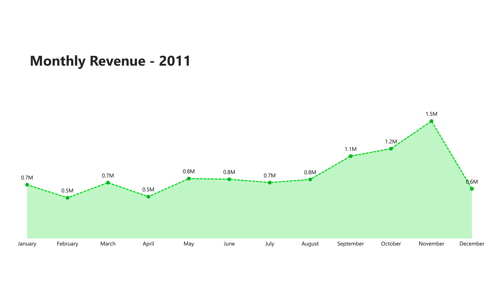
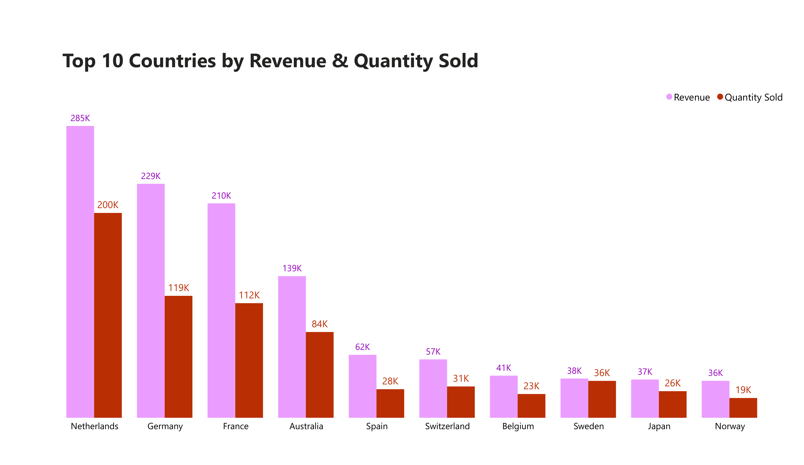
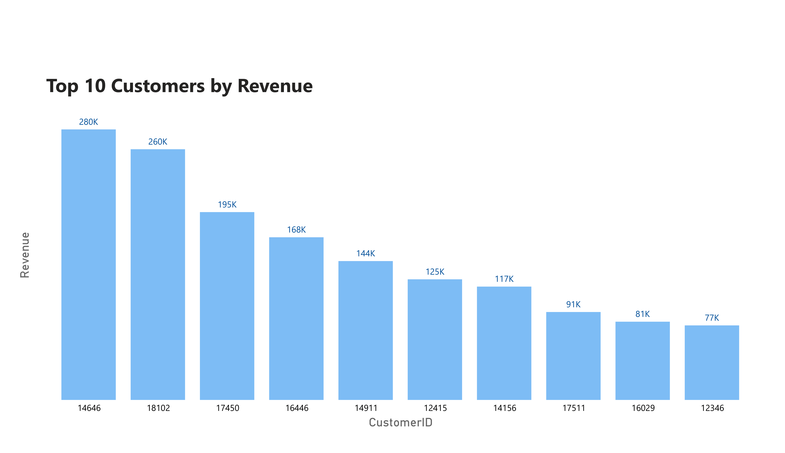
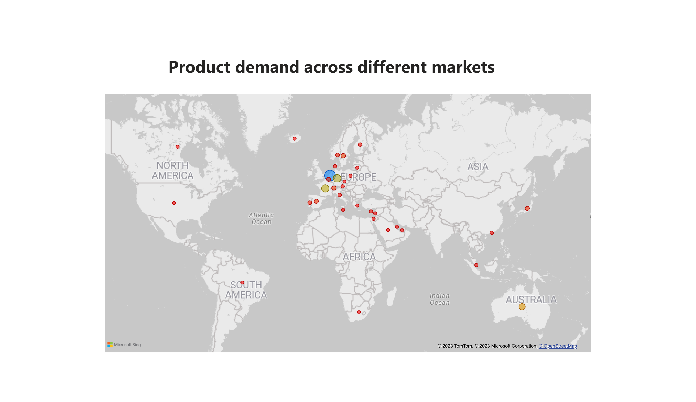

## Tata Virtual Experience

### - Background

This is my task 3 submission from the Tata Virtual Experience program. During this program, I learned the following:

* Framing the Business Scenario.
* Choosing the Right Visuals.
* Creating Effective Visuals.
* Communicating Insights and Analysis.

### - The Task

* Clean the given data.
* Perform basic analysis.
* Create a CEO-CMO-centric report using BI tools.

### - My Submission

